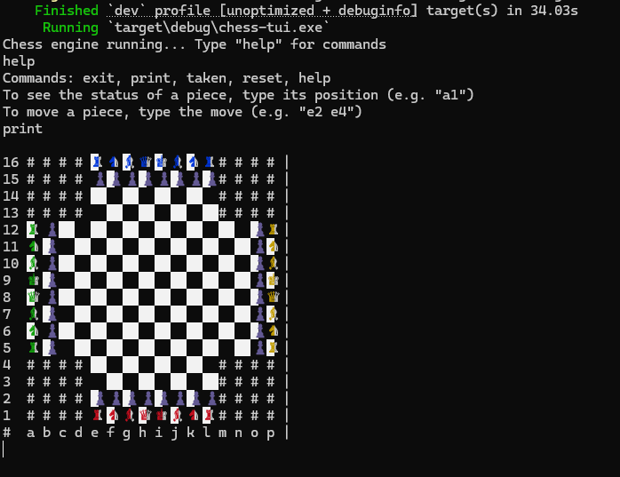
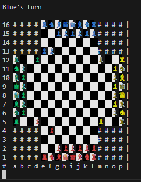

# Terminal Chess App

I created a local terminal interface and attempted an implementation at a server-client architecture for playing chess games. The terminal interface is basic but functional, allowing users to play chess games in the terminal. The server-client architecture is a work in progress, with the server handling game logic and the client managing user interactions.

Both normal chess games and Chess360 games are supported. To play a Chess360 game, run the application with the `--360` flag.

## Images

